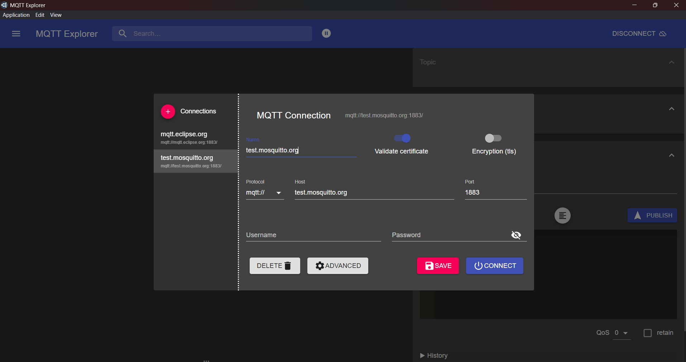

# Projeto ESP32 - Cliente MQTT5 para Controle de LED

---

## Descrição

Este projeto implementa um cliente MQTT no ESP32 usando ESP-IDF e MQTT 5.  
O dispositivo conecta-se à rede Wi-Fi, conecta a um broker MQTT e se inscreve no tópico:

```
/ifpe/ads/embarcados/esp32/led
```

Quando recebe a mensagem `1` nesse tópico, o LED onboard acende.  
Quando recebe a mensagem `0`, o LED apaga.

---

## Configuração do ambiente

### 1. Pré-requisitos

- ESP-IDF instalado (versão recomendada: 5.x)
- Toolchain configurada (compilador, Python, etc)
- Cabo USB para conectar o ESP32 ao computador

---

### 2. Criar um projeto MQTT5 usando um template da extenção ESP-IDF.

1. Abra a extenção.
2. New project.
3. Selecionar o seu esp-idf.
4. Defina nome do projeto e escolha uma pasta.
5. click em Choose Template.
6. Escolha ESP-IDF e busque por 'mqtt5'.
7. 'create project using template mqtt5'.
8. Project projetoUnidade1 has been created. Open project in a new window? 'yes'.

### 3. Configuração Wi-Fi e Broker MQTT

Antes de compilar, configure o Wi-Fi e o broker MQTT usando o menuconfig do ESP-IDF:

```bash
idf.py menuconfig
```

- Navegue até **Example Configuration > WiFi SSID** e insira sua rede (NOME) Wi-Fi
- Navegue até **Example Configuration > WiFi Password** e insira sua senha
- Configure o broker MQTT em **Example Configuration -> MQTT Broker URL** e insira a URL
  1. mqtt://broker.hivemq.com:1883, ou;
  2. mqtt://<SEU-IP>:1883
- Salve e saia do menuconfig.

---

## Como compilar e gravar o firmware

No terminal, estando dentro da pasta do projeto, execute:

```bash
idf.py build
idf.py -p COMx flash monitor
```

> Substitua `COMx` pela porta serial do seu ESP32 (exemplo: `COM5` no Windows).

O monitor abrirá mostrando os logs de conexão Wi-Fi, conexão MQTT e eventos diversos.

---

## Testando o controle do LED

Com o ESP32 conectado e o firmware rodando:

1.  Utilize um cliente MQTT (exemplos: MQTT Explorer, MQTT.fx, mosquitto_pub)
    ## Como exemplo, vamos utilizar o `MQTT EXPLORER`:
        1. Vá até -> https://mqtt-explorer.com/
        2. Após o Download ser concluído, clique 2 vezes sobre o instalador e instale-o
        3. Ao Abrir o Aplicativo, do lado Esquerdo, Cliquei em "+ Connections";
        4. Preencha "Name" com um nome de sua preferência;
        5. Em "Protocol", permanece o que já estar;
        6. Em "Host", preencha com `broker.hivemq.com`;
        7. Em "Port", preencha com `1883`;
        8. "Username" e "Password", podem ficar em branco;
        9. Clique em "Advanced", Cole em Topic `/ifpe/ads/embarcados/esp32/led`, em seguida "ADD" e "BACK";
        10. Desative "VALIDATE CERTIFICATE" e "ENCRYPTION (TLS)";
        11. Clique em "SAVE" e em "CONNECT";

---

## Exemplos visuais do MQTT Explorer

<div style="text-align: center;">
  <br/>
  <i>Tela inicial do MQTT Explorer, após criar uma nova conexão.</i>
</div>

<div style="text-align: center; margin-top: 20px;">
  <br/>
  <i>Configuração do broker com endereço e porta.</i>
</div>

<div style="text-align: center; margin-top: 20px;">
  <br/>
  <i>Adicionando tópico para monitoramento.</i>
</div>

<div style="text-align: center; margin-top: 20px;">
  <br/>
  <i>Tópico adicionado, pronto para conectar.</i>
</div>

<div style="text-align: center; margin-top: 20px;">
  <br/>
  <i>Visualização das mensagens recebidas.</i>
</div>

<div style="text-align: center; margin-top: 20px;">
  <br/>
  <i>Publicando mensagem para controlar o LED.</i>
</div>

---

2. Publique mensagens no tópico:

```
/ifpe/ads/embarcados/esp32/led
```

- Envie o payload `1` para acender o LED
- Envie o payload `0` para apagar o LED

---

## Limpeza do ambiente

Para limpar os arquivos gerados pelo build e reiniciar a compilação do zero, execute:

```bash
idf.py fullclean
```

---

## Contato

Matheus Lima

---
